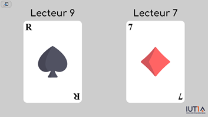
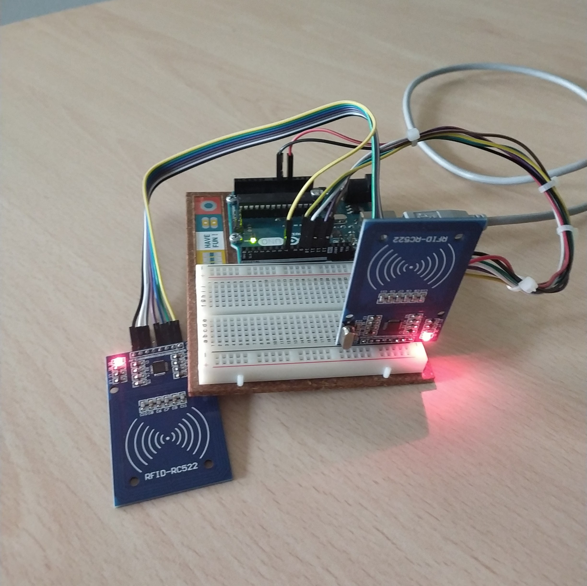

# Card game visualization

This project was carried out as part of a work-study project at IUT 1 in Grenoble.


It is a web application designed to guess poker cards equipped with rfid tags passed in front of one or more RC522 sensors. The application uses [serialport](https://github.com/serialport/node-serialport) for communication with an Arduino UNO R3 (equiped with RC522 modules), and is packaged in an Electron application for porting to Windows.

This project was carried out within the scope of the FAME project (Formation et attractivité des métiers de l'électronique) supported by the [UGA](https://www.univ-grenoble-alpes.fr/) as part of a demonstrator showcasing electronics and embedded systems projects. It's intended as a short presentation on NFC/RFID technologies, to raise awareness among a non-expert audience (especially schoolchildren) of the fact that NFC/RFID is everywhere (building access badges, payment cards, public transport, anti-theft devices, etc.) and what it is. With a demonstrator they can come and handle and test.


## Features 🛫

- 1 to 3 RFID modules displayed simultaneously on the screen (limited to keep the card size large enough for good readability)
- As many UID(*Unique Identification*) matches <-> card images as you want
- easy addition/removal of new cards
- view saved card faces with associated UIDs
- export/import card list
- automatic saving of card list to file for future reference (after reboot for example)

## System requirements 💻

You must have Windows system with x64/x86 arch to install the .exe

### Arduino

> FYI : this code initialize pins 1 to 9 as SDA/SS for esclave selection, technically we can have 9 readers in the same time on SPI bus. desktop application is configured to display 3, or rather the 3 last to have send an UID



> Code based on MFRC522.h example for multiple readers
```cpp
#include <SPI.h>
#include <MFRC522.h>

#define RST_PIN 10

// SCK : 13
// MISO 12
// MOSI : 11

// Initialise les pins 0 à 9 en tant que SS pin pouvant être affecter à un RFID via SPI
byte ssPins[] = {9, 8, 7, 6, 5, 4, 3, 2, 1};
byte nb_pins = 9;
MFRC522 mfrc522[9];

MFRC522::MIFARE_Key key;

void setup() { 
  Serial.begin(9600);
  SPI.begin();
  
  for (uint8_t pin = 0; pin < nb_pins; pin++) {
    
    mfrc522[pin].PCD_Init(ssPins[pin], RST_PIN); // Init each MFRC522 card
    Serial.print(ssPins[pin]);
    Serial.print("$$");
    mfrc522[pin].PCD_DumpVersionToSerial();
  }

  for (byte i = 0; i < 6; i++) {
    key.keyByte[i] = 0xFF;
  }
}
 

void loop() {

  for (uint8_t pin = 0; pin < nb_pins; pin++) {

  // Verifie si la carte est sur le lecteur
    if (mfrc522[pin].PICC_IsNewCardPresent() && mfrc522[pin].PICC_ReadCardSerial()) {

      Serial.print(ssPins[pin]);
      Serial.print("|");
      printHex(mfrc522[pin].uid.uidByte, mfrc522[pin].uid.size);
      Serial.print("\n");


      // Halt PICC
      mfrc522[pin].PICC_HaltA();
      mfrc522[pin].PCD_StopCrypto1();
    }
  }
}

/**
 * Helper routine to dump a byte array as hex values to Serial. 
 */
void printHex(byte *buffer, byte bufferSize) {
  for (byte i = 0; i < bufferSize; i++) {
    Serial.print(buffer[i] < 0x10 ? "0" : "");
    Serial.print(buffer[i], HEX);
  }
}
```

## Installation ⬇️

1. go to "Releases"
2. Download the latest
3. run the .exe

For devs :
1. Clone this repository on your machine.
3. Run `npm install` to install the dependencies (which are not minify in ./js.libs/).
4. Launch the application by running `npm start`.

## Usage

1. Launch the application.
3. Select the COM port corresponding as your Arduino (code and details above)
4. View the cards

> The square at top left with the logo is a button opening a configuration menu.


## Acknowledgements

- [Serialport-node](https://github.com/serialport/node-serialport)
- [SweetAlert2](https://github.com/sweetalert2/sweetalert2)
- [Electron-json-storage](https://github.com/electron-userland/electron-json-storage)
- <a href="https://www.flaticon.com/free-icons/nfc" title="nfc icons">Nfc icons created by logisstudio - Flaticon</a>

## License

This project is licensed under [insert license here]. See the LICENSE file for details.